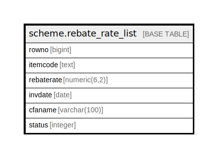

# scheme.rebate_rate_list

## Description

## Columns

| Name | Type | Default | Nullable | Children | Parents | Comment |
| ---- | ---- | ------- | -------- | -------- | ------- | ------- |
| rowno | bigint |  | true |  |  |  |
| itemcode | text |  | true |  |  |  |
| rebaterate | numeric(6,2) |  | true |  |  |  |
| invdate | date |  | true |  |  |  |
| cfaname | varchar(100) |  | true |  |  |  |
| status | integer |  | true |  |  |  |

## Relations

---

> Generated by [tbls](https://github.com/k1LoW/tbls)
