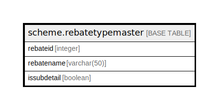

# scheme.rebatetypemaster

## Description

## Columns

| Name | Type | Default | Nullable | Children | Parents | Comment |
| ---- | ---- | ------- | -------- | -------- | ------- | ------- |
| rebateid | integer | nextval('scheme.rebatetypemaster_rebateid_seq'::regclass) | false |  |  |  |
| rebatename | varchar(50) |  | true |  |  |  |
| issubdetail | boolean | false | true |  |  |  |

## Constraints

| Name | Type | Definition |
| ---- | ---- | ---------- |
| rebatetypemaster_pkey | PRIMARY KEY | PRIMARY KEY (rebateid) |

## Indexes

| Name | Definition |
| ---- | ---------- |
| rebatetypemaster_pkey | CREATE UNIQUE INDEX rebatetypemaster_pkey ON scheme.rebatetypemaster USING btree (rebateid) |

## Relations

---

> Generated by [tbls](https://github.com/k1LoW/tbls)
