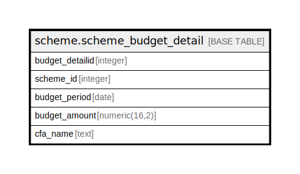

# scheme.scheme_budget_detail

## Description

## Columns

| Name | Type | Default | Nullable | Children | Parents | Comment |
| ---- | ---- | ------- | -------- | -------- | ------- | ------- |
| budget_detailid | integer | nextval('scheme.scheme_budget_detail_budget_detailid_seq'::regclass) | false |  |  |  |
| scheme_id | integer |  | true |  |  |  |
| budget_period | date |  | true |  |  |  |
| budget_amount | numeric(16,2) |  | true |  |  |  |
| cfa_name | text |  | true |  |  |  |

## Relations

---

> Generated by [tbls](https://github.com/k1LoW/tbls)
