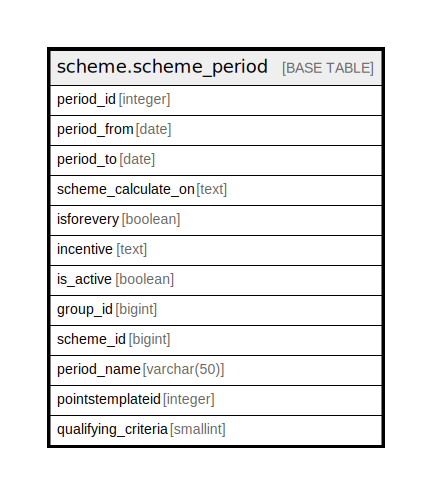

# scheme.scheme_period

## Description

## Columns

| Name | Type | Default | Nullable | Children | Parents | Comment |
| ---- | ---- | ------- | -------- | -------- | ------- | ------- |
| period_id | integer | nextval('scheme.scheme_period_period_id_seq'::regclass) | false |  |  |  |
| period_from | date |  | true |  |  |  |
| period_to | date |  | true |  |  |  |
| scheme_calculate_on | text |  | true |  |  |  |
| isforevery | boolean |  | true |  |  |  |
| incentive | text |  | true |  |  |  |
| is_active | boolean |  | true |  |  |  |
| group_id | bigint |  | true |  |  |  |
| scheme_id | bigint |  | true |  |  |  |
| period_name | varchar(50) |  | true |  |  |  |
| pointstemplateid | integer |  | true |  |  |  |
| qualifying_criteria | smallint |  | true |  |  |  |

## Constraints

| Name | Type | Definition |
| ---- | ---- | ---------- |
| scheme_period_pkey | PRIMARY KEY | PRIMARY KEY (period_id) |

## Indexes

| Name | Definition |
| ---- | ---------- |
| scheme_period_pkey | CREATE UNIQUE INDEX scheme_period_pkey ON scheme.scheme_period USING btree (period_id) |

## Relations

---

> Generated by [tbls](https://github.com/k1LoW/tbls)
