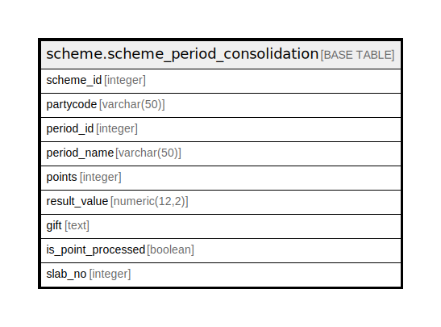

# scheme.scheme_period_consolidation

## Description

## Columns

| Name | Type | Default | Nullable | Children | Parents | Comment |
| ---- | ---- | ------- | -------- | -------- | ------- | ------- |
| scheme_id | integer |  | true |  |  |  |
| partycode | varchar(50) |  | true |  |  |  |
| period_id | integer |  | true |  |  |  |
| period_name | varchar(50) |  | true |  |  |  |
| points | integer |  | true |  |  |  |
| result_value | numeric(12,2) |  | true |  |  |  |
| gift | text |  | true |  |  |  |
| is_point_processed | boolean | false | true |  |  |  |
| slab_no | integer |  | true |  |  |  |

## Relations

---

> Generated by [tbls](https://github.com/k1LoW/tbls)
