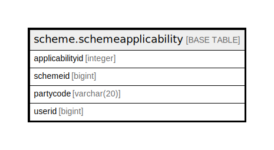

# scheme.schemeapplicability

## Description

## Columns

| Name | Type | Default | Nullable | Children | Parents | Comment |
| ---- | ---- | ------- | -------- | -------- | ------- | ------- |
| applicabilityid | integer | nextval('scheme.schemeapplicability_applicabilityid_seq'::regclass) | false |  |  |  |
| schemeid | bigint |  | true |  |  |  |
| partycode | varchar(20) |  | true |  |  |  |
| userid | bigint |  | true |  |  |  |

## Constraints

| Name | Type | Definition |
| ---- | ---- | ---------- |
| schemeapplicability_pkey | PRIMARY KEY | PRIMARY KEY (applicabilityid) |

## Indexes

| Name | Definition |
| ---- | ---------- |
| schemeapplicability_pkey | CREATE UNIQUE INDEX schemeapplicability_pkey ON scheme.schemeapplicability USING btree (applicabilityid) |

## Relations

---

> Generated by [tbls](https://github.com/k1LoW/tbls)
