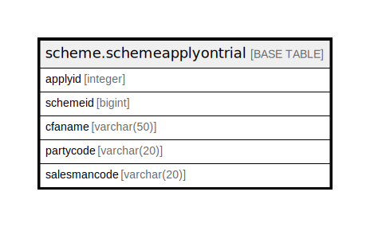

# scheme.schemeapplyontrial

## Description

## Columns

| Name | Type | Default | Nullable | Children | Parents | Comment |
| ---- | ---- | ------- | -------- | -------- | ------- | ------- |
| applyid | integer | nextval('scheme.schemeapplyontrial_applyid_seq'::regclass) | false |  |  |  |
| schemeid | bigint |  | true |  |  |  |
| cfaname | varchar(50) |  | true |  |  |  |
| partycode | varchar(20) |  | true |  |  |  |
| salesmancode | varchar(20) |  | true |  |  |  |

## Constraints

| Name | Type | Definition |
| ---- | ---- | ---------- |
| schemeapplyontrial_pkey | PRIMARY KEY | PRIMARY KEY (applyid) |

## Indexes

| Name | Definition |
| ---- | ---------- |
| schemeapplyontrial_pkey | CREATE UNIQUE INDEX schemeapplyontrial_pkey ON scheme.schemeapplyontrial USING btree (applyid) |

## Relations

---

> Generated by [tbls](https://github.com/k1LoW/tbls)
