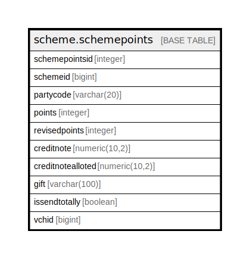

# scheme.schemepoints

## Description

## Columns

| Name | Type | Default | Nullable | Children | Parents | Comment |
| ---- | ---- | ------- | -------- | -------- | ------- | ------- |
| schemepointsid | integer | nextval('scheme.schemepoints_schemepointsid_seq'::regclass) | false |  |  |  |
| schemeid | bigint |  | true |  |  |  |
| partycode | varchar(20) |  | true |  |  |  |
| points | integer |  | true |  |  |  |
| revisedpoints | integer |  | true |  |  |  |
| creditnote | numeric(10,2) |  | true |  |  |  |
| creditnotealloted | numeric(10,2) |  | true |  |  |  |
| gift | varchar(100) |  | true |  |  |  |
| issendtotally | boolean | false | true |  |  |  |
| vchid | bigint | 0 | true |  |  |  |

## Constraints

| Name | Type | Definition |
| ---- | ---- | ---------- |
| schemepoints_pkey | PRIMARY KEY | PRIMARY KEY (schemepointsid) |

## Indexes

| Name | Definition |
| ---- | ---------- |
| schemepoints_pkey | CREATE UNIQUE INDEX schemepoints_pkey ON scheme.schemepoints USING btree (schemepointsid) |

## Relations

---

> Generated by [tbls](https://github.com/k1LoW/tbls)
