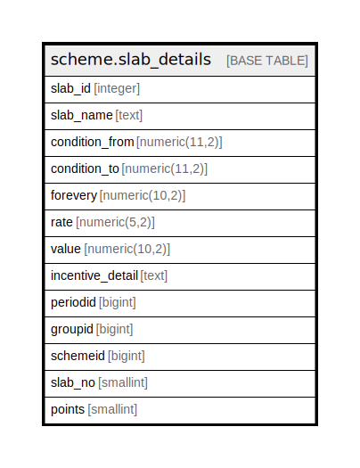

# scheme.slab_details

## Description

## Columns

| Name | Type | Default | Nullable | Children | Parents | Comment |
| ---- | ---- | ------- | -------- | -------- | ------- | ------- |
| slab_id | integer | nextval('scheme.slab_details_slab_id_seq'::regclass) | false |  |  |  |
| slab_name | text |  | true |  |  |  |
| condition_from | numeric(11,2) |  | true |  |  |  |
| condition_to | numeric(11,2) |  | true |  |  |  |
| forevery | numeric(10,2) |  | true |  |  |  |
| rate | numeric(5,2) |  | true |  |  |  |
| value | numeric(10,2) |  | true |  |  |  |
| incentive_detail | text |  | true |  |  |  |
| periodid | bigint |  | true |  |  |  |
| groupid | bigint |  | true |  |  |  |
| schemeid | bigint |  | true |  |  |  |
| slab_no | smallint |  | true |  |  |  |
| points | smallint |  | true |  |  |  |

## Constraints

| Name | Type | Definition |
| ---- | ---- | ---------- |
| slab_details_pkey | PRIMARY KEY | PRIMARY KEY (slab_id) |

## Indexes

| Name | Definition |
| ---- | ---------- |
| slab_details_pkey | CREATE UNIQUE INDEX slab_details_pkey ON scheme.slab_details USING btree (slab_id) |

## Relations

---

> Generated by [tbls](https://github.com/k1LoW/tbls)
