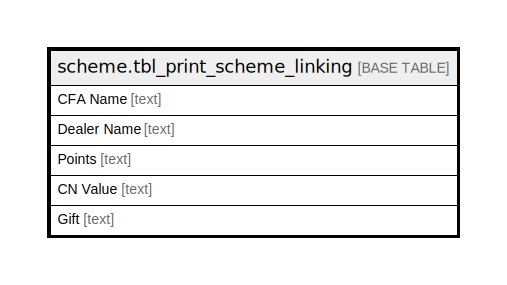

# scheme.tbl_print_scheme_linking

## Description

## Columns

| Name | Type | Default | Nullable | Children | Parents | Comment |
| ---- | ---- | ------- | -------- | -------- | ------- | ------- |
| CFA Name | text |  | true |  |  |  |
| Dealer Name | text |  | true |  |  |  |
| Points | text |  | true |  |  |  |
| CN Value | text |  | true |  |  |  |
| Gift | text |  | true |  |  |  |

## Relations

---

> Generated by [tbls](https://github.com/k1LoW/tbls)
