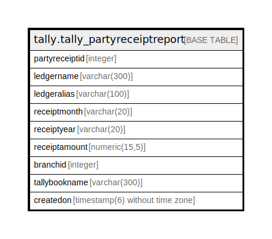

# tally.tally_partyreceiptreport

## Description

## Columns

| Name | Type | Default | Nullable | Children | Parents | Comment |
| ---- | ---- | ------- | -------- | -------- | ------- | ------- |
| partyreceiptid | integer | nextval('tally.tally_partyreceiptreport_partyreceiptid_seq'::regclass) | false |  |  |  |
| ledgername | varchar(300) |  | true |  |  |  |
| ledgeralias | varchar(100) |  | true |  |  |  |
| receiptmonth | varchar(20) |  | true |  |  |  |
| receiptyear | varchar(20) |  | true |  |  |  |
| receiptamount | numeric(15,5) |  | true |  |  |  |
| branchid | integer |  | true |  |  |  |
| tallybookname | varchar(300) |  | true |  |  |  |
| createdon | timestamp(6) without time zone | now() | true |  |  |  |

## Constraints

| Name | Type | Definition |
| ---- | ---- | ---------- |
| tally_partyreceiptreport_pkey | PRIMARY KEY | PRIMARY KEY (partyreceiptid) |

## Indexes

| Name | Definition |
| ---- | ---------- |
| tally_partyreceiptreport_pkey | CREATE UNIQUE INDEX tally_partyreceiptreport_pkey ON tally.tally_partyreceiptreport USING btree (partyreceiptid) |

## Relations

---

> Generated by [tbls](https://github.com/k1LoW/tbls)
