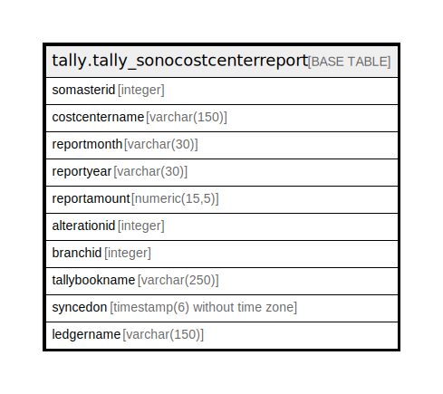

# tally.tally_sonocostcenterreport

## Description

## Columns

| Name | Type | Default | Nullable | Children | Parents | Comment |
| ---- | ---- | ------- | -------- | -------- | ------- | ------- |
| somasterid | integer | nextval('tally.tally_sonocostcenterreport_somasterid_seq'::regclass) | false |  |  |  |
| costcentername | varchar(150) |  | true |  |  |  |
| reportmonth | varchar(30) |  | true |  |  |  |
| reportyear | varchar(30) |  | true |  |  |  |
| reportamount | numeric(15,5) |  | true |  |  |  |
| alterationid | integer |  | true |  |  |  |
| branchid | integer |  | true |  |  |  |
| tallybookname | varchar(250) |  | true |  |  |  |
| syncedon | timestamp(6) without time zone | now() | true |  |  |  |
| ledgername | varchar(150) |  | true |  |  |  |

## Constraints

| Name | Type | Definition |
| ---- | ---- | ---------- |
| tally_sonocostcenterreport_pkey | PRIMARY KEY | PRIMARY KEY (somasterid) |

## Indexes

| Name | Definition |
| ---- | ---------- |
| tally_sonocostcenterreport_pkey | CREATE UNIQUE INDEX tally_sonocostcenterreport_pkey ON tally.tally_sonocostcenterreport USING btree (somasterid) |

## Relations

---

> Generated by [tbls](https://github.com/k1LoW/tbls)
