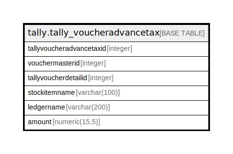

# tally.tally_voucheradvancetax

## Description

## Columns

| Name | Type | Default | Nullable | Children | Parents | Comment |
| ---- | ---- | ------- | -------- | -------- | ------- | ------- |
| tallyvoucheradvancetaxid | integer | nextval('tally.tally_voucheradvancetax_tallyvoucheradvancetaxid_seq'::regclass) | false |  |  |  |
| vouchermasterid | integer |  | true |  |  |  |
| tallyvoucherdetailid | integer |  | true |  |  |  |
| stockitemname | varchar(100) |  | true |  |  |  |
| ledgername | varchar(200) |  | true |  |  |  |
| amount | numeric(15,5) |  | true |  |  |  |

## Constraints

| Name | Type | Definition |
| ---- | ---- | ---------- |
| tally_voucheradvancetax_pkey | PRIMARY KEY | PRIMARY KEY (tallyvoucheradvancetaxid) |

## Indexes

| Name | Definition |
| ---- | ---------- |
| tally_voucheradvancetax_pkey | CREATE UNIQUE INDEX tally_voucheradvancetax_pkey ON tally.tally_voucheradvancetax USING btree (tallyvoucheradvancetaxid) |

## Relations

---

> Generated by [tbls](https://github.com/k1LoW/tbls)
