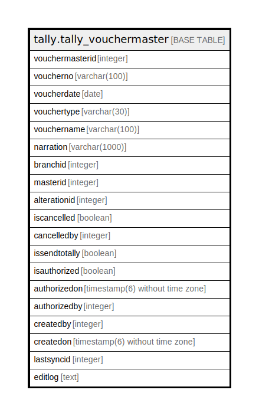

# tally.tally_vouchermaster

## Description

## Columns

| Name | Type | Default | Nullable | Children | Parents | Comment |
| ---- | ---- | ------- | -------- | -------- | ------- | ------- |
| vouchermasterid | integer | nextval('tally.tally_vouchermaster_vouchermasterid_seq'::regclass) | false |  |  |  |
| voucherno | varchar(100) |  | true |  |  |  |
| voucherdate | date |  | true |  |  |  |
| vouchertype | varchar(30) |  | true |  |  |  |
| vouchername | varchar(100) |  | true |  |  |  |
| narration | varchar(1000) |  | true |  |  |  |
| branchid | integer |  | true |  |  |  |
| masterid | integer |  | true |  |  |  |
| alterationid | integer |  | true |  |  |  |
| iscancelled | boolean | false | true |  |  |  |
| cancelledby | integer |  | true |  |  |  |
| issendtotally | boolean | false | false |  |  |  |
| isauthorized | boolean | false | false |  |  |  |
| authorizedon | timestamp(6) without time zone |  | true |  |  |  |
| authorizedby | integer |  | true |  |  |  |
| createdby | integer |  | true |  |  |  |
| createdon | timestamp(6) without time zone | now() | true |  |  |  |
| lastsyncid | integer |  | true |  |  |  |
| editlog | text |  | true |  |  |  |

## Constraints

| Name | Type | Definition |
| ---- | ---- | ---------- |
| tally_vouchermaster_pkey | PRIMARY KEY | PRIMARY KEY (vouchermasterid) |

## Indexes

| Name | Definition |
| ---- | ---------- |
| tally_vouchermaster_pkey | CREATE UNIQUE INDEX tally_vouchermaster_pkey ON tally.tally_vouchermaster USING btree (vouchermasterid) |

## Relations

---

> Generated by [tbls](https://github.com/k1LoW/tbls)
