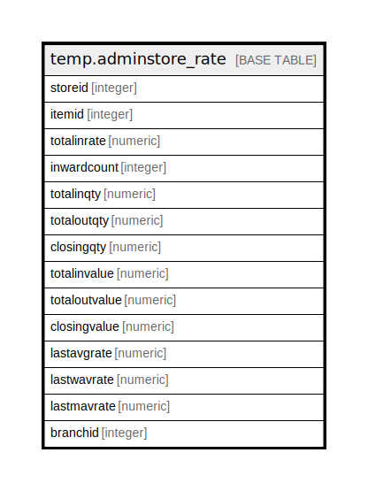

# temp.adminstore_rate

## Description

## Columns

| Name | Type | Default | Nullable | Children | Parents | Comment |
| ---- | ---- | ------- | -------- | -------- | ------- | ------- |
| storeid | integer |  | true |  |  |  |
| itemid | integer |  | true |  |  |  |
| totalinrate | numeric |  | true |  |  |  |
| inwardcount | integer |  | true |  |  |  |
| totalinqty | numeric |  | true |  |  |  |
| totaloutqty | numeric |  | true |  |  |  |
| closingqty | numeric |  | true |  |  |  |
| totalinvalue | numeric |  | true |  |  |  |
| totaloutvalue | numeric |  | true |  |  |  |
| closingvalue | numeric |  | true |  |  |  |
| lastavgrate | numeric |  | true |  |  |  |
| lastwavrate | numeric |  | true |  |  |  |
| lastmavrate | numeric |  | true |  |  |  |
| branchid | integer |  | true |  |  |  |

## Relations

---

> Generated by [tbls](https://github.com/k1LoW/tbls)
