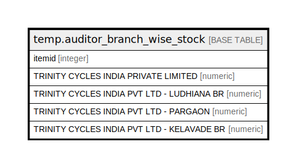

# temp.auditor_branch_wise_stock

## Description

## Columns

| Name | Type | Default | Nullable | Children | Parents | Comment |
| ---- | ---- | ------- | -------- | -------- | ------- | ------- |
| itemid | integer |  | true |  |  |  |
| TRINITY CYCLES INDIA PRIVATE LIMITED | numeric |  | true |  |  |  |
| TRINITY CYCLES INDIA PVT LTD - LUDHIANA BR | numeric |  | true |  |  |  |
| TRINITY CYCLES INDIA PVT LTD - PARGAON | numeric |  | true |  |  |  |
| TRINITY CYCLES INDIA PVT LTD - KELAVADE BR | numeric |  | true |  |  |  |

## Relations

---

> Generated by [tbls](https://github.com/k1LoW/tbls)
