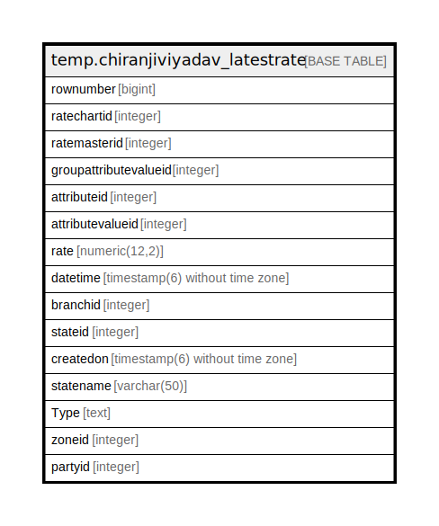

# temp.chiranjiviyadav_latestrate

## Description

## Columns

| Name | Type | Default | Nullable | Children | Parents | Comment |
| ---- | ---- | ------- | -------- | -------- | ------- | ------- |
| rownumber | bigint |  | true |  |  |  |
| ratechartid | integer |  | true |  |  |  |
| ratemasterid | integer |  | true |  |  |  |
| groupattributevalueid | integer |  | true |  |  |  |
| attributeid | integer |  | true |  |  |  |
| attributevalueid | integer |  | true |  |  |  |
| rate | numeric(12,2) |  | true |  |  |  |
| datetime | timestamp(6) without time zone |  | true |  |  |  |
| branchid | integer |  | true |  |  |  |
| stateid | integer |  | true |  |  |  |
| createdon | timestamp(6) without time zone |  | true |  |  |  |
| statename | varchar(50) |  | true |  |  |  |
| Type | text |  | true |  |  |  |
| zoneid | integer |  | true |  |  |  |
| partyid | integer |  | true |  |  |  |

## Relations

---

> Generated by [tbls](https://github.com/k1LoW/tbls)
