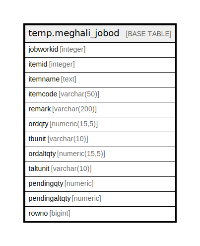

# temp.meghali_jobod

## Description

## Columns

| Name | Type | Default | Nullable | Children | Parents | Comment |
| ---- | ---- | ------- | -------- | -------- | ------- | ------- |
| jobworkid | integer |  | true |  |  |  |
| itemid | integer |  | true |  |  |  |
| itemname | text |  | true |  |  |  |
| itemcode | varchar(50) |  | true |  |  |  |
| remark | varchar(200) |  | true |  |  |  |
| ordqty | numeric(15,5) |  | true |  |  |  |
| tbunit | varchar(10) |  | true |  |  |  |
| ordaltqty | numeric(15,5) |  | true |  |  |  |
| taltunit | varchar(10) |  | true |  |  |  |
| pendingqty | numeric |  | true |  |  |  |
| pendingaltqty | numeric |  | true |  |  |  |
| rowno | bigint |  | true |  |  |  |

## Relations

---

> Generated by [tbls](https://github.com/k1LoW/tbls)
