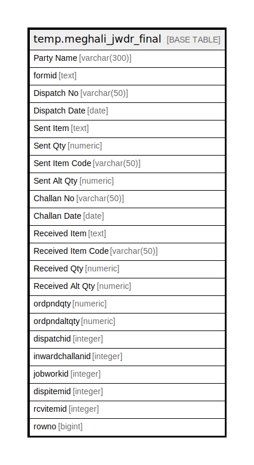

# temp.meghali_jwdr_final

## Description

## Columns

| Name | Type | Default | Nullable | Children | Parents | Comment |
| ---- | ---- | ------- | -------- | -------- | ------- | ------- |
| Party Name | varchar(300) |  | true |  |  |  |
| formid | text |  | true |  |  |  |
| Dispatch No | varchar(50) |  | true |  |  |  |
| Dispatch Date | date |  | true |  |  |  |
| Sent Item | text |  | true |  |  |  |
| Sent Qty | numeric |  | true |  |  |  |
| Sent Item Code | varchar(50) |  | true |  |  |  |
| Sent Alt Qty | numeric |  | true |  |  |  |
| Challan No | varchar(50) |  | true |  |  |  |
| Challan Date | date |  | true |  |  |  |
| Received Item | text |  | true |  |  |  |
| Received Item Code | varchar(50) |  | true |  |  |  |
| Received Qty | numeric |  | true |  |  |  |
| Received Alt Qty | numeric |  | true |  |  |  |
| ordpndqty | numeric |  | true |  |  |  |
| ordpndaltqty | numeric |  | true |  |  |  |
| dispatchid | integer |  | true |  |  |  |
| inwardchallanid | integer |  | true |  |  |  |
| jobworkid | integer |  | true |  |  |  |
| dispitemid | integer |  | true |  |  |  |
| rcvitemid | integer |  | true |  |  |  |
| rowno | bigint |  | true |  |  |  |

## Relations

---

> Generated by [tbls](https://github.com/k1LoW/tbls)
