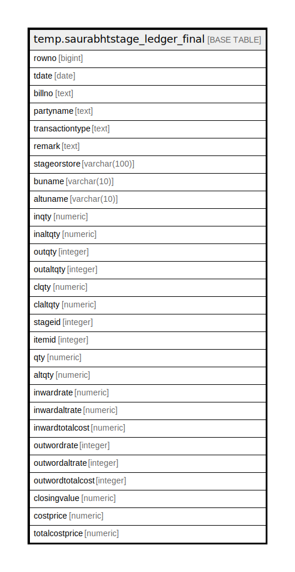

# temp.saurabhtstage_ledger_final

## Description

## Columns

| Name | Type | Default | Nullable | Children | Parents | Comment |
| ---- | ---- | ------- | -------- | -------- | ------- | ------- |
| rowno | bigint |  | true |  |  |  |
| tdate | date |  | true |  |  |  |
| billno | text |  | true |  |  |  |
| partyname | text |  | true |  |  |  |
| transactiontype | text |  | true |  |  |  |
| remark | text |  | true |  |  |  |
| stageorstore | varchar(100) |  | true |  |  |  |
| buname | varchar(10) |  | true |  |  |  |
| altuname | varchar(10) |  | true |  |  |  |
| inqty | numeric |  | true |  |  |  |
| inaltqty | numeric |  | true |  |  |  |
| outqty | integer |  | true |  |  |  |
| outaltqty | integer |  | true |  |  |  |
| clqty | numeric |  | true |  |  |  |
| claltqty | numeric |  | true |  |  |  |
| stageid | integer |  | true |  |  |  |
| itemid | integer |  | true |  |  |  |
| qty | numeric |  | true |  |  |  |
| altqty | numeric |  | true |  |  |  |
| inwardrate | numeric |  | true |  |  |  |
| inwardaltrate | numeric |  | true |  |  |  |
| inwardtotalcost | numeric |  | true |  |  |  |
| outwordrate | integer |  | true |  |  |  |
| outwordaltrate | integer |  | true |  |  |  |
| outwordtotalcost | integer |  | true |  |  |  |
| closingvalue | numeric |  | true |  |  |  |
| costprice | numeric |  | true |  |  |  |
| totalcostprice | numeric |  | true |  |  |  |

## Relations

---

> Generated by [tbls](https://github.com/k1LoW/tbls)
