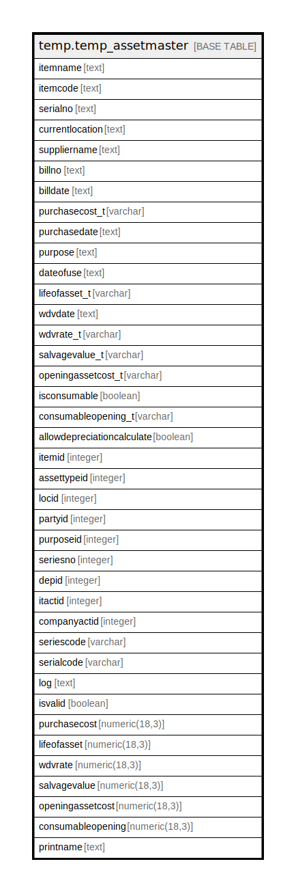

# temp.temp_assetmaster

## Description

## Columns

| Name | Type | Default | Nullable | Children | Parents | Comment |
| ---- | ---- | ------- | -------- | -------- | ------- | ------- |
| itemname | text |  | true |  |  |  |
| itemcode | text |  | true |  |  |  |
| serialno | text |  | true |  |  |  |
| currentlocation | text |  | true |  |  |  |
| suppliername | text |  | true |  |  |  |
| billno | text |  | true |  |  |  |
| billdate | text |  | true |  |  |  |
| purchasecost_t | varchar |  | true |  |  |  |
| purchasedate | text |  | true |  |  |  |
| purpose | text |  | true |  |  |  |
| dateofuse | text |  | true |  |  |  |
| lifeofasset_t | varchar |  | true |  |  |  |
| wdvdate | text |  | true |  |  |  |
| wdvrate_t | varchar |  | true |  |  |  |
| salvagevalue_t | varchar |  | true |  |  |  |
| openingassetcost_t | varchar |  | true |  |  |  |
| isconsumable | boolean |  | true |  |  |  |
| consumableopening_t | varchar |  | true |  |  |  |
| allowdepreciationcalculate | boolean |  | true |  |  |  |
| itemid | integer |  | true |  |  |  |
| assettypeid | integer |  | true |  |  |  |
| locid | integer |  | true |  |  |  |
| partyid | integer |  | true |  |  |  |
| purposeid | integer |  | true |  |  |  |
| seriesno | integer |  | true |  |  |  |
| depid | integer |  | true |  |  |  |
| itactid | integer |  | true |  |  |  |
| companyactid | integer |  | true |  |  |  |
| seriescode | varchar |  | true |  |  |  |
| serialcode | varchar |  | true |  |  |  |
| log | text |  | true |  |  |  |
| isvalid | boolean |  | true |  |  |  |
| purchasecost | numeric(18,3) |  | true |  |  |  |
| lifeofasset | numeric(18,3) |  | true |  |  |  |
| wdvrate | numeric(18,3) |  | true |  |  |  |
| salvagevalue | numeric(18,3) |  | true |  |  |  |
| openingassetcost | numeric(18,3) |  | true |  |  |  |
| consumableopening | numeric(18,3) |  | true |  |  |  |
| printname | text |  | true |  |  |  |

## Relations

---

> Generated by [tbls](https://github.com/k1LoW/tbls)
