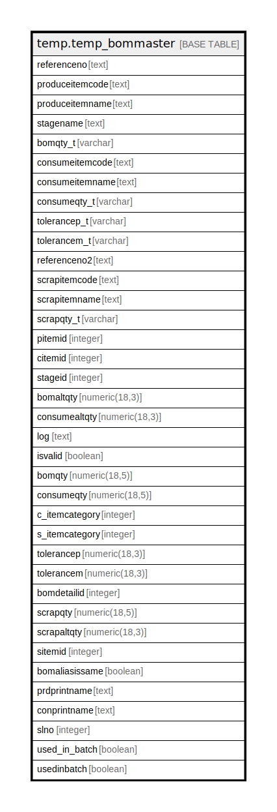

# temp.temp_bommaster

## Description

## Columns

| Name | Type | Default | Nullable | Children | Parents | Comment |
| ---- | ---- | ------- | -------- | -------- | ------- | ------- |
| referenceno | text |  | true |  |  |  |
| produceitemcode | text |  | true |  |  |  |
| produceitemname | text |  | true |  |  |  |
| stagename | text |  | true |  |  |  |
| bomqty_t | varchar |  | true |  |  |  |
| consumeitemcode | text |  | true |  |  |  |
| consumeitemname | text |  | true |  |  |  |
| consumeqty_t | varchar |  | true |  |  |  |
| tolerancep_t | varchar |  | true |  |  |  |
| tolerancem_t | varchar |  | true |  |  |  |
| referenceno2 | text |  | true |  |  |  |
| scrapitemcode | text |  | true |  |  |  |
| scrapitemname | text |  | true |  |  |  |
| scrapqty_t | varchar |  | true |  |  |  |
| pitemid | integer |  | true |  |  |  |
| citemid | integer |  | true |  |  |  |
| stageid | integer |  | true |  |  |  |
| bomaltqty | numeric(18,3) |  | true |  |  |  |
| consumealtqty | numeric(18,3) |  | true |  |  |  |
| log | text |  | true |  |  |  |
| isvalid | boolean |  | true |  |  |  |
| bomqty | numeric(18,5) |  | true |  |  |  |
| consumeqty | numeric(18,5) |  | true |  |  |  |
| c_itemcategory | integer |  | true |  |  |  |
| s_itemcategory | integer |  | true |  |  |  |
| tolerancep | numeric(18,3) |  | true |  |  |  |
| tolerancem | numeric(18,3) |  | true |  |  |  |
| bomdetailid | integer |  | true |  |  |  |
| scrapqty | numeric(18,5) |  | true |  |  |  |
| scrapaltqty | numeric(18,3) |  | true |  |  |  |
| sitemid | integer |  | true |  |  |  |
| bomaliasissame | boolean |  | true |  |  |  |
| prdprintname | text |  | true |  |  |  |
| conprintname | text |  | true |  |  |  |
| slno | integer |  | true |  |  |  |
| used_in_batch | boolean |  | true |  |  |  |
| usedinbatch | boolean |  | true |  |  |  |

## Relations

---

> Generated by [tbls](https://github.com/k1LoW/tbls)
