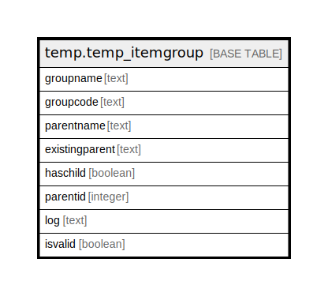

# temp.temp_itemgroup

## Description

## Columns

| Name | Type | Default | Nullable | Children | Parents | Comment |
| ---- | ---- | ------- | -------- | -------- | ------- | ------- |
| groupname | text |  | true |  |  |  |
| groupcode | text |  | true |  |  |  |
| parentname | text |  | true |  |  |  |
| existingparent | text |  | true |  |  |  |
| haschild | boolean |  | true |  |  |  |
| parentid | integer |  | true |  |  |  |
| log | text |  | true |  |  |  |
| isvalid | boolean |  | true |  |  |  |

## Relations

---

> Generated by [tbls](https://github.com/k1LoW/tbls)
