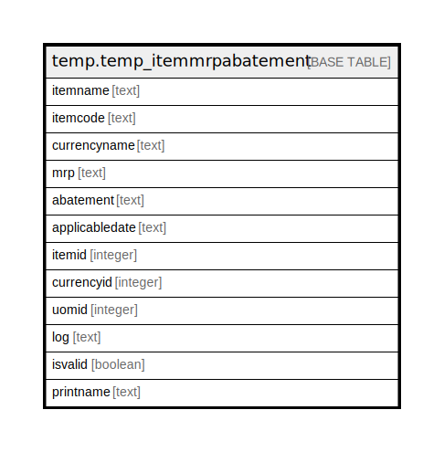

# temp.temp_itemmrpabatement

## Description

## Columns

| Name | Type | Default | Nullable | Children | Parents | Comment |
| ---- | ---- | ------- | -------- | -------- | ------- | ------- |
| itemname | text |  | true |  |  |  |
| itemcode | text |  | true |  |  |  |
| currencyname | text |  | true |  |  |  |
| mrp | text |  | true |  |  |  |
| abatement | text |  | true |  |  |  |
| applicabledate | text |  | true |  |  |  |
| itemid | integer |  | true |  |  |  |
| currencyid | integer |  | true |  |  |  |
| uomid | integer |  | true |  |  |  |
| log | text |  | true |  |  |  |
| isvalid | boolean |  | true |  |  |  |
| printname | text |  | true |  |  |  |

## Relations

---

> Generated by [tbls](https://github.com/k1LoW/tbls)
