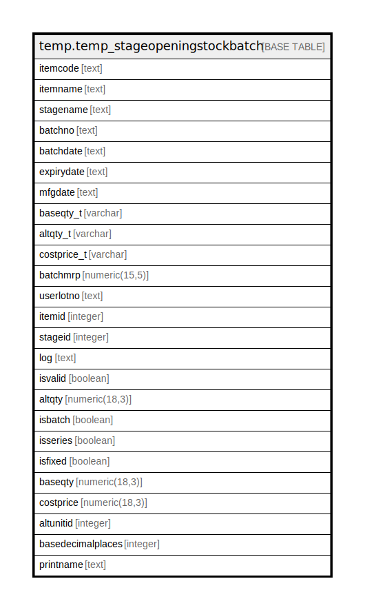

# temp.temp_stageopeningstockbatch

## Description

## Columns

| Name | Type | Default | Nullable | Children | Parents | Comment |
| ---- | ---- | ------- | -------- | -------- | ------- | ------- |
| itemcode | text |  | true |  |  |  |
| itemname | text |  | true |  |  |  |
| stagename | text |  | true |  |  |  |
| batchno | text |  | true |  |  |  |
| batchdate | text |  | true |  |  |  |
| expirydate | text |  | true |  |  |  |
| mfgdate | text |  | true |  |  |  |
| baseqty_t | varchar |  | true |  |  |  |
| altqty_t | varchar |  | true |  |  |  |
| costprice_t | varchar |  | true |  |  |  |
| batchmrp | numeric(15,5) |  | true |  |  |  |
| userlotno | text |  | true |  |  |  |
| itemid | integer |  | true |  |  |  |
| stageid | integer |  | true |  |  |  |
| log | text |  | true |  |  |  |
| isvalid | boolean |  | true |  |  |  |
| altqty | numeric(18,3) |  | true |  |  |  |
| isbatch | boolean |  | true |  |  |  |
| isseries | boolean |  | true |  |  |  |
| isfixed | boolean |  | true |  |  |  |
| baseqty | numeric(18,3) |  | true |  |  |  |
| costprice | numeric(18,3) |  | true |  |  |  |
| altunitid | integer |  | true |  |  |  |
| basedecimalplaces | integer |  | true |  |  |  |
| printname | text |  | true |  |  |  |

## Relations

---

> Generated by [tbls](https://github.com/k1LoW/tbls)
