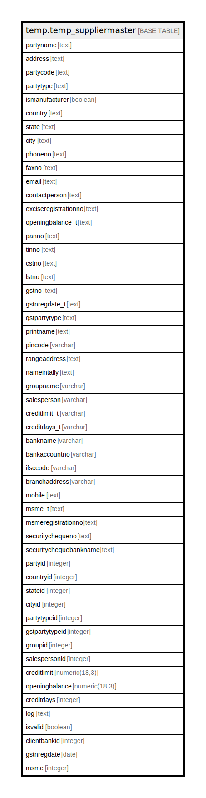

# temp.temp_suppliermaster

## Description

## Columns

| Name | Type | Default | Nullable | Children | Parents | Comment |
| ---- | ---- | ------- | -------- | -------- | ------- | ------- |
| partyname | text |  | true |  |  |  |
| address | text |  | true |  |  |  |
| partycode | text |  | true |  |  |  |
| partytype | text |  | true |  |  |  |
| ismanufacturer | boolean |  | true |  |  |  |
| country | text |  | true |  |  |  |
| state | text |  | true |  |  |  |
| city | text |  | true |  |  |  |
| phoneno | text |  | true |  |  |  |
| faxno | text |  | true |  |  |  |
| email | text |  | true |  |  |  |
| contactperson | text |  | true |  |  |  |
| exciseregistrationno | text |  | true |  |  |  |
| openingbalance_t | text |  | true |  |  |  |
| panno | text |  | true |  |  |  |
| tinno | text |  | true |  |  |  |
| cstno | text |  | true |  |  |  |
| lstno | text |  | true |  |  |  |
| gstno | text |  | true |  |  |  |
| gstnregdate_t | text |  | true |  |  |  |
| gstpartytype | text |  | true |  |  |  |
| printname | text |  | true |  |  |  |
| pincode | varchar |  | true |  |  |  |
| rangeaddress | text |  | true |  |  |  |
| nameintally | text |  | true |  |  |  |
| groupname | varchar |  | true |  |  |  |
| salesperson | varchar |  | true |  |  |  |
| creditlimit_t | varchar |  | true |  |  |  |
| creditdays_t | varchar |  | true |  |  |  |
| bankname | varchar |  | true |  |  |  |
| bankaccountno | varchar |  | true |  |  |  |
| ifsccode | varchar |  | true |  |  |  |
| branchaddress | varchar |  | true |  |  |  |
| mobile | text |  | true |  |  |  |
| msme_t | text |  | true |  |  |  |
| msmeregistrationno | text |  | true |  |  |  |
| securitychequeno | text |  | true |  |  |  |
| securitychequebankname | text |  | true |  |  |  |
| partyid | integer |  | true |  |  |  |
| countryid | integer |  | true |  |  |  |
| stateid | integer |  | true |  |  |  |
| cityid | integer |  | true |  |  |  |
| partytypeid | integer |  | true |  |  |  |
| gstpartytypeid | integer |  | true |  |  |  |
| groupid | integer |  | true |  |  |  |
| salespersonid | integer |  | true |  |  |  |
| creditlimit | numeric(18,3) |  | true |  |  |  |
| openingbalance | numeric(18,3) |  | true |  |  |  |
| creditdays | integer |  | true |  |  |  |
| log | text |  | true |  |  |  |
| isvalid | boolean |  | true |  |  |  |
| clientbankid | integer |  | true |  |  |  |
| gstnregdate | date |  | true |  |  |  |
| msme | integer |  | true |  |  |  |

## Relations

---

> Generated by [tbls](https://github.com/k1LoW/tbls)
