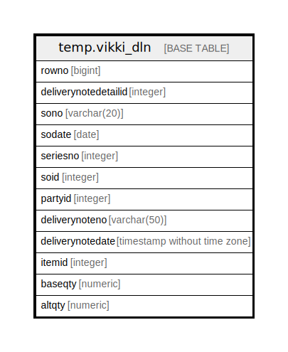

# temp.vikki_dln

## Description

## Columns

| Name | Type | Default | Nullable | Children | Parents | Comment |
| ---- | ---- | ------- | -------- | -------- | ------- | ------- |
| rowno | bigint |  | true |  |  |  |
| deliverynotedetailid | integer |  | true |  |  |  |
| sono | varchar(20) |  | true |  |  |  |
| sodate | date |  | true |  |  |  |
| seriesno | integer |  | true |  |  |  |
| soid | integer |  | true |  |  |  |
| partyid | integer |  | true |  |  |  |
| deliverynoteno | varchar(50) |  | true |  |  |  |
| deliverynotedate | timestamp without time zone |  | true |  |  |  |
| itemid | integer |  | true |  |  |  |
| baseqty | numeric |  | true |  |  |  |
| altqty | numeric |  | true |  |  |  |

## Relations

---

> Generated by [tbls](https://github.com/k1LoW/tbls)
