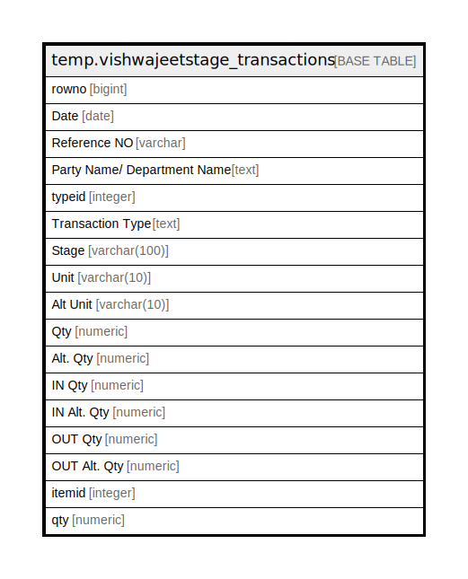

# temp.vishwajeetstage_transactions

## Description

## Columns

| Name | Type | Default | Nullable | Children | Parents | Comment |
| ---- | ---- | ------- | -------- | -------- | ------- | ------- |
| rowno | bigint |  | true |  |  |  |
| Date | date |  | true |  |  |  |
| Reference NO | varchar |  | true |  |  |  |
| Party Name/ Department Name | text |  | true |  |  |  |
| typeid | integer |  | true |  |  |  |
| Transaction Type | text |  | true |  |  |  |
| Stage | varchar(100) |  | true |  |  |  |
| Unit | varchar(10) |  | true |  |  |  |
| Alt Unit | varchar(10) |  | true |  |  |  |
| Qty | numeric |  | true |  |  |  |
| Alt. Qty | numeric |  | true |  |  |  |
| IN Qty | numeric |  | true |  |  |  |
| IN Alt. Qty | numeric |  | true |  |  |  |
| OUT Qty | numeric |  | true |  |  |  |
| OUT Alt. Qty | numeric |  | true |  |  |  |
| itemid | integer |  | true |  |  |  |
| qty | numeric |  | true |  |  |  |

## Relations

---

> Generated by [tbls](https://github.com/k1LoW/tbls)
