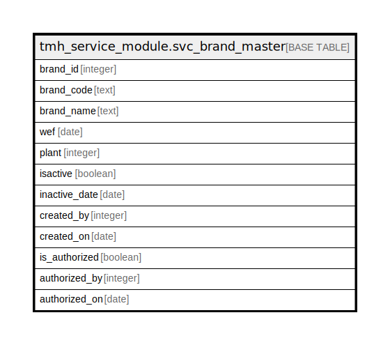

# tmh_service_module.svc_brand_master

## Description

## Columns

| Name | Type | Default | Nullable | Children | Parents | Comment |
| ---- | ---- | ------- | -------- | -------- | ------- | ------- |
| brand_id | integer | nextval('tmh_service_module.svc_brand_master_brand_id_seq'::regclass) | false |  |  |  |
| brand_code | text |  | true |  |  |  |
| brand_name | text |  | true |  |  |  |
| wef | date |  | true |  |  |  |
| plant | integer |  | true |  |  |  |
| isactive | boolean | true | true |  |  |  |
| inactive_date | date |  | true |  |  |  |
| created_by | integer |  | true |  |  |  |
| created_on | date |  | true |  |  |  |
| is_authorized | boolean |  | true |  |  |  |
| authorized_by | integer |  | true |  |  |  |
| authorized_on | date |  | true |  |  |  |

## Constraints

| Name | Type | Definition |
| ---- | ---- | ---------- |
| svc_brand_master_pkey | PRIMARY KEY | PRIMARY KEY (brand_id) |

## Indexes

| Name | Definition |
| ---- | ---------- |
| svc_brand_master_pkey | CREATE UNIQUE INDEX svc_brand_master_pkey ON tmh_service_module.svc_brand_master USING btree (brand_id) |

## Relations

---

> Generated by [tbls](https://github.com/k1LoW/tbls)
