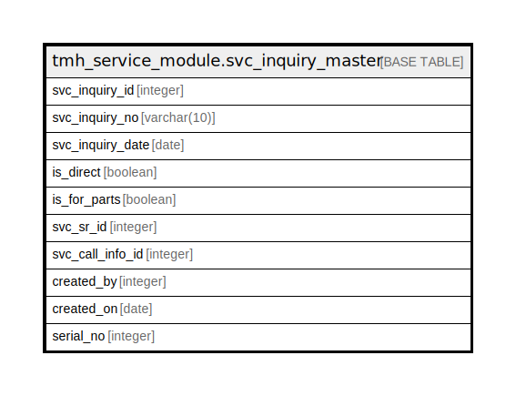

# tmh_service_module.svc_inquiry_master

## Description

## Columns

| Name | Type | Default | Nullable | Children | Parents | Comment |
| ---- | ---- | ------- | -------- | -------- | ------- | ------- |
| svc_inquiry_id | integer | nextval('tmh_service_module.svc_inquiry_master_svc_inquiry_id_seq'::regclass) | false |  |  |  |
| svc_inquiry_no | varchar(10) |  | false |  |  |  |
| svc_inquiry_date | date |  | false |  |  |  |
| is_direct | boolean |  | false |  |  |  |
| is_for_parts | boolean |  | false |  |  |  |
| svc_sr_id | integer |  | true |  |  |  |
| svc_call_info_id | integer |  | false |  |  |  |
| created_by | integer |  | true |  |  |  |
| created_on | date |  | true |  |  |  |
| serial_no | integer | 0 | true |  |  |  |

## Constraints

| Name | Type | Definition |
| ---- | ---- | ---------- |
| svc_inquiry_master_pkey | PRIMARY KEY | PRIMARY KEY (svc_inquiry_id) |

## Indexes

| Name | Definition |
| ---- | ---------- |
| svc_inquiry_master_pkey | CREATE UNIQUE INDEX svc_inquiry_master_pkey ON tmh_service_module.svc_inquiry_master USING btree (svc_inquiry_id) |

## Relations

---

> Generated by [tbls](https://github.com/k1LoW/tbls)
