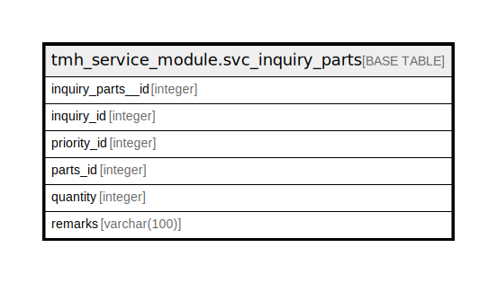

# tmh_service_module.svc_inquiry_parts

## Description

## Columns

| Name | Type | Default | Nullable | Children | Parents | Comment |
| ---- | ---- | ------- | -------- | -------- | ------- | ------- |
| inquiry_parts__id | integer | nextval('tmh_service_module.svc_inquiry_parts_inquiry_parts__id_seq'::regclass) | false |  |  |  |
| inquiry_id | integer |  | false |  |  |  |
| priority_id | integer |  | true |  |  |  |
| parts_id | integer |  | true |  |  |  |
| quantity | integer |  | true |  |  |  |
| remarks | varchar(100) | NULL::character varying | true |  |  |  |

## Relations

---

> Generated by [tbls](https://github.com/k1LoW/tbls)
