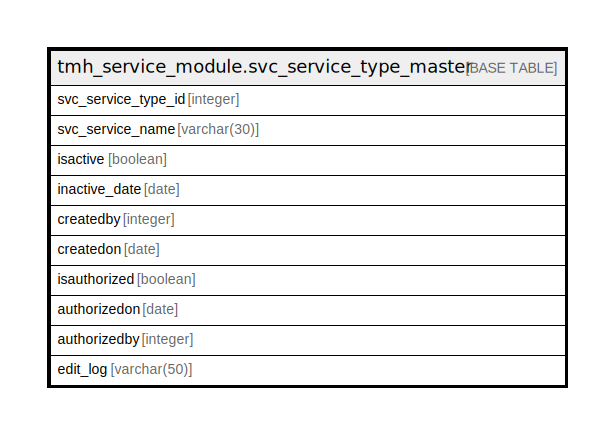

# tmh_service_module.svc_service_type_master

## Description

## Columns

| Name | Type | Default | Nullable | Children | Parents | Comment |
| ---- | ---- | ------- | -------- | -------- | ------- | ------- |
| svc_service_type_id | integer | nextval('tmh_service_module.svc_service_type_master_svc_service_type_id_seq'::regclass) | false |  |  |  |
| svc_service_name | varchar(30) |  | true |  |  |  |
| isactive | boolean | true | true |  |  |  |
| inactive_date | date |  | true |  |  |  |
| createdby | integer |  | true |  |  |  |
| createdon | date |  | true |  |  |  |
| isauthorized | boolean | false | true |  |  |  |
| authorizedon | date |  | true |  |  |  |
| authorizedby | integer |  | true |  |  |  |
| edit_log | varchar(50) |  | true |  |  |  |

## Constraints

| Name | Type | Definition |
| ---- | ---- | ---------- |
| svc_service_type_master_pkey | PRIMARY KEY | PRIMARY KEY (svc_service_type_id) |

## Indexes

| Name | Definition |
| ---- | ---------- |
| svc_service_type_master_pkey | CREATE UNIQUE INDEX svc_service_type_master_pkey ON tmh_service_module.svc_service_type_master USING btree (svc_service_type_id) |

## Relations

---

> Generated by [tbls](https://github.com/k1LoW/tbls)
