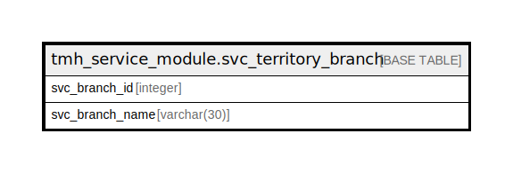

# tmh_service_module.svc_territory_branch

## Description

## Columns

| Name | Type | Default | Nullable | Children | Parents | Comment |
| ---- | ---- | ------- | -------- | -------- | ------- | ------- |
| svc_branch_id | integer | nextval('tmh_service_module.svc_territory_branch_svc_branch_id_seq'::regclass) | false |  |  |  |
| svc_branch_name | varchar(30) |  | true |  |  |  |

## Constraints

| Name | Type | Definition |
| ---- | ---- | ---------- |
| svc_territory_branch_pkey | PRIMARY KEY | PRIMARY KEY (svc_branch_id) |

## Indexes

| Name | Definition |
| ---- | ---------- |
| svc_territory_branch_pkey | CREATE UNIQUE INDEX svc_territory_branch_pkey ON tmh_service_module.svc_territory_branch USING btree (svc_branch_id) |

## Relations

---

> Generated by [tbls](https://github.com/k1LoW/tbls)
