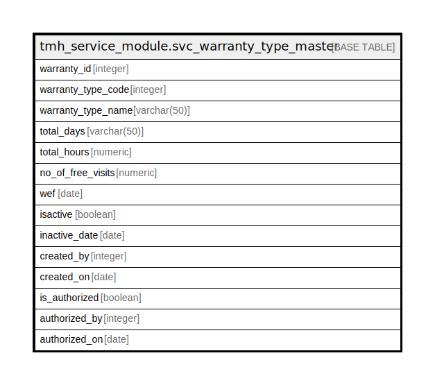

# tmh_service_module.svc_warranty_type_master

## Description

## Columns

| Name | Type | Default | Nullable | Children | Parents | Comment |
| ---- | ---- | ------- | -------- | -------- | ------- | ------- |
| warranty_id | integer | nextval('tmh_service_module.svc_warranty_type_master_warranty_id_seq'::regclass) | false |  |  |  |
| warranty_type_code | integer |  | true |  |  |  |
| warranty_type_name | varchar(50) |  | true |  |  |  |
| total_days | varchar(50) |  | true |  |  |  |
| total_hours | numeric |  | true |  |  |  |
| no_of_free_visits | numeric |  | true |  |  |  |
| wef | date |  | true |  |  |  |
| isactive | boolean | true | true |  |  |  |
| inactive_date | date |  | true |  |  |  |
| created_by | integer |  | true |  |  |  |
| created_on | date |  | true |  |  |  |
| is_authorized | boolean | false | true |  |  |  |
| authorized_by | integer |  | true |  |  |  |
| authorized_on | date |  | true |  |  |  |

## Constraints

| Name | Type | Definition |
| ---- | ---- | ---------- |
| svc_warranty_type_master_pkey | PRIMARY KEY | PRIMARY KEY (warranty_id) |

## Indexes

| Name | Definition |
| ---- | ---------- |
| svc_warranty_type_master_pkey | CREATE UNIQUE INDEX svc_warranty_type_master_pkey ON tmh_service_module.svc_warranty_type_master USING btree (warranty_id) |

## Relations

---

> Generated by [tbls](https://github.com/k1LoW/tbls)
